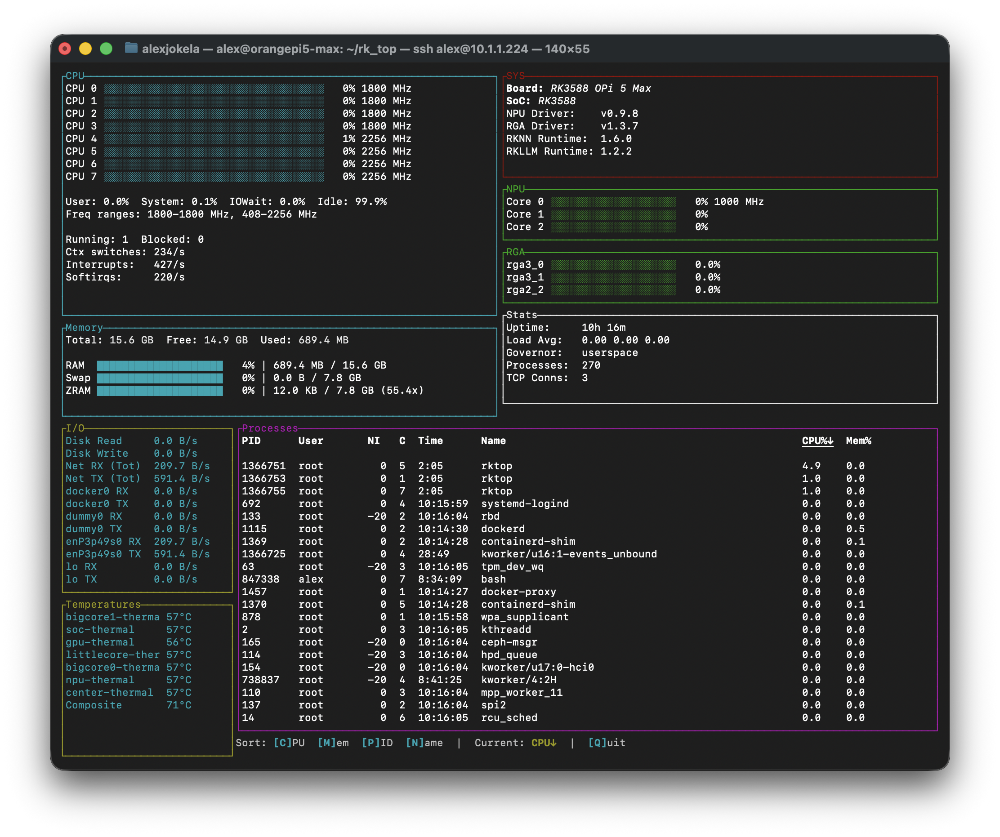

# rktop - Rockchip System Monitor

A high-performance system monitoring tool specifically designed for Rockchip SoC devices (RK3588, RK3399, etc.), written in Rust using the Ratatui TUI framework.



## Features

### Hardware Monitoring
- **CPU**: Per-core usage, frequencies, time breakdown (user/system/iowait/idle)
- **GPU (Mali)**: Utilization percentage and frequency
- **NPU**: Per-core load and frequency
- **RGA**: Graphics accelerator scheduler load (shows all RGA cores)
- **Memory**: RAM, Swap, and ZRAM usage with detailed statistics
- **Temperatures**: All thermal sensors (CPU, GPU, NPU, etc.)
- **Network & Disk I/O**: Real-time transfer rates per adapter

### Process Information
- **Interactive Sorting**: Sort by CPU, Memory, PID, or Name (ascending/descending)
- **Detailed Metrics**: PID, User, Nice level, CPU core affinity, Runtime, CPU%, Memory%
- **Dynamic Display**: Shows as many processes as fit in the terminal

### System Statistics
- System uptime and load average
- CPU governor and frequency ranges (per cluster)
- Running and blocked process counts
- Context switches, interrupts, and softirqs per second
- External TCP connection count

### Driver & Runtime Versions
- NPU kernel driver version
- RGA kernel driver version
- RKNN Runtime library version
- RKLLM Runtime library version

## Performance

Optimized for minimal CPU overhead:
- **<1% CPU usage** during normal operation
- Cached static information (versions, hardware availability)
- UID-to-username caching (eliminates process spawns)
- Throttled refresh rates (1s/2s/3s/5s for different data types)
- Efficient hardware detection (checks availability once at startup)

## Installation

### Prerequisites

- Rockchip SoC-based device (RK3588, RK3399, etc.)
- Linux with sysfs and debugfs mounted
- Rust toolchain (for building from source)

### Building from Source

```bash
# Clone the repository
git clone <repository-url>
cd rk_top

# Build release binary
cargo build --release

# Binary will be at target/release/rktop
```

### Installing System-Wide

```bash
# Copy binary to system path
sudo cp target/release/rktop /usr/local/bin/

# Make executable
sudo chmod +x /usr/local/bin/rktop
```

## Usage

### Basic Usage

```bash
# Run with root privileges (required for debugfs access)
sudo rktop
```

### Keyboard Controls

| Key | Action |
|-----|--------|
| `q`, `Q`, `Esc` | Quit |
| `c` | Toggle CPU sort (ascending/descending) |
| `m` | Toggle Memory sort (ascending/descending) |
| `p` | Toggle PID sort (ascending/descending) |
| `n` | Toggle Name sort (ascending/descending) |

### Running Without Root (Optional)

You can grant specific capabilities to avoid requiring root:

```bash
# Grant file read and process trace capabilities
sudo setcap cap_dac_read_search,cap_sys_ptrace=eip /usr/local/bin/rktop

# Now you can run without sudo
rktop
```

**Note**: Capabilities are removed if the binary is modified. Re-run `setcap` after updates.

## Display Panels

### CPU Panel
- Per-core usage bars with frequency
- CPU time breakdown (User, System, IOWait, Idle percentages)
- Frequency ranges for each CPU cluster (big.LITTLE)
- Running and blocked process counts
- Context switches, interrupts, and softirqs per second

### Memory Panel
- RAM usage (used + cached / total)
- Swap usage
- ZRAM usage with compression ratio
- Detailed breakdown (Total, Free, Used, Cache, Shared)

### GPU Panel (if available)
- Mali GPU utilization percentage
- Current GPU frequency

### NPU Panel (if available)
- Per-core NPU load (0-2 cores typical)
- NPU frequency

### RGA Panel (if available)
- Per-scheduler load for all RGA cores
- RK3588 example: rga3_0, rga3_1, rga2_2

### System Info Panel
- Board name and SoC model
- NPU driver version
- RGA driver version
- RKNN Runtime version
- RKLLM Runtime version

### Stats Panel
- System uptime
- Load average (1/5/15 min)
- CPU governor
- Total process count
- External TCP connections

### I/O Panel
- Disk read/write rates
- Network RX/TX rates (total)
- Per-adapter network rates

### Temperature Panel
- All thermal sensors
- Real-time temperature readings

### Process Panel
- **PID** - Process ID
- **User** - Username
- **NI** - Nice level (priority)
- **C** - Current CPU core (0-7)
- **Time** - Process runtime (MM:SS or HH:MM:SS)
- **Name** - Process name
- **CPU%** - CPU usage
- **Mem%** - Memory usage

## Architecture

### Multi-Module Design

- **src/main.rs** - Main application, TUI rendering, event loop, state management
- **src/hardware.rs** - Rockchip-specific hardware detection and monitoring
- **src/sysinfo_ext.rs** - Extended system information (processes, ZRAM, TCP stats)

### Key Design Patterns

**Caching for Performance**
- Static information cached at startup (board name, versions, hardware availability)
- Hardware availability checks prevent unnecessary sysfs reads every frame
- UID-to-username mapping cached to eliminate process spawns

**Throttled Refresh Intervals**
- CPU/Memory: 1 second
- Network/Disk I/O: 2 seconds
- Processes: 3 seconds
- Stats (uptime, load, governor, TCP): 5 seconds

**Graceful Hardware Detection**
- Functions return `Option<T>` or empty values when hardware unavailable
- UI panels conditionally render based on cached availability checks
- Works on non-Rockchip systems (shows basic CPU/memory/process info)

## Rockchip-Specific Features

### Supported SoCs
- RK3588 (tested on Orange Pi 5 Max)
- RK3399
- Other Rockchip SoCs with Mali GPU, NPU, and/or RGA

### Hardware Interfaces
The tool reads from Rockchip-specific kernel interfaces:

**Debugfs** (requires root or capabilities):
- `/sys/kernel/debug/mali0/` - GPU utilization
- `/sys/kernel/debug/rknpu/` - NPU load and version
- `/sys/kernel/debug/rkrga/` - RGA load and version

**Sysfs** (standard access):
- `/sys/devices/platform/fb000000.gpu-panthor/devfreq/` - GPU frequency
- `/sys/class/devfreq/fdab0000.npu/` - NPU frequency
- `/sys/devices/system/cpu/cpu*/cpufreq/` - CPU frequencies

**Device Tree**:
- `/proc/device-tree/model` - Board name and SoC detection

### RK3588 Specifics

**CPU Clusters**:
- CPU 0-3: Big cores (typically 1800-2400 MHz)
- CPU 4-7: LITTLE cores (408-2256 MHz)

**RGA Cores**:
- 3 schedulers total: 2× RGA3 + 1× RGA2
- Displayed as: rga3_0, rga3_1, rga2_2

**NPU Cores**:
- 3 cores (Core 0, Core 1, Core 2)
- Each with independent load monitoring

## Troubleshooting

### "Root permissions required" error
The tool needs access to debugfs. Either:
1. Run with `sudo rktop`
2. Grant capabilities: `sudo setcap cap_dac_read_search,cap_sys_ptrace=eip /usr/local/bin/rktop`

### GPU/NPU/RGA shows "not available"
- Ensure debugfs is mounted: `mount | grep debugfs`
- Check kernel drivers are loaded: `lsmod | grep -E "mali|npu|rga"`
- Some boards may not have all accelerators

### Version detection fails
- Ensure runtime libraries are installed in `/usr/lib/`
- Library paths may vary by distribution
- Uses `strings` command to extract versions

### High CPU usage
- Normal usage should be <1% CPU
- If higher, check `strace` output: `sudo strace -c -p $(pgrep rktop)`
- Verify caching is working (no excessive file opens)

## Dependencies

**Rust Crates**:
- `ratatui` (0.28) - Terminal UI framework
- `crossterm` (0.28) - Terminal manipulation and event handling
- `sysinfo` (0.32) - System and process information
- `regex` (1.11) - Regular expression parsing for hardware data
- `anyhow` (1.0) - Error handling
- `nix` (0.29) - Unix system calls (for root check)

**System Requirements**:
- Linux kernel with sysfs and debugfs support
- For full features: Mali GPU, NPU, and RGA drivers loaded

## Performance Notes

From profiling with `strace -c`:
- Zero subprocess spawns during normal operation (after startup)
- Minimal file I/O through aggressive caching
- <1% CPU usage on RK3588 (Orange Pi 5 Max)

## Technical Details

### Process Monitoring
- Reads `/proc/[pid]/stat` for nice level and CPU core affinity
- Uses sysinfo crate for CPU/memory usage
- Implements global UID-to-username cache (Mutex-wrapped HashMap)
- Reduces process spawns from 260+/sec to 0-2/sec

### CPU Statistics
- Parses `/proc/stat` for context switches, interrupts, softirqs
- Calculates per-second rates from deltas
- Computes CPU time percentages (user/system/iowait/idle)

### Network Monitoring
- Per-adapter RX/TX rate calculation
- Refreshed every 2 seconds to reduce file I/O
- Shows both aggregate and per-adapter statistics

### Temperature Sensors
- Reads from `/sys/class/thermal/thermal_zone*/`
- Also checks `/sys/class/hwmon/` for additional sensors
- Filters out duplicate thermal zones

## Known Limitations

- **Rockchip-specific**: Some features only work on Rockchip SoCs
- **Debugfs access**: Requires root or capabilities for full functionality
- **Library versions**: Depends on `strings` command and library paths
- **No NPU process mapping**: Cannot show which process uses which NPU core (kernel limitation)

## Related Projects

- **yarktop** - Python-based predecessor (available in separate repository)

## License

This project is licensed under the BSD 3-Clause License - see the [LICENSE](LICENSE) file for details.

## Credits

Developed for Rockchip SBC enthusiasts who want detailed hardware monitoring with minimal overhead.
